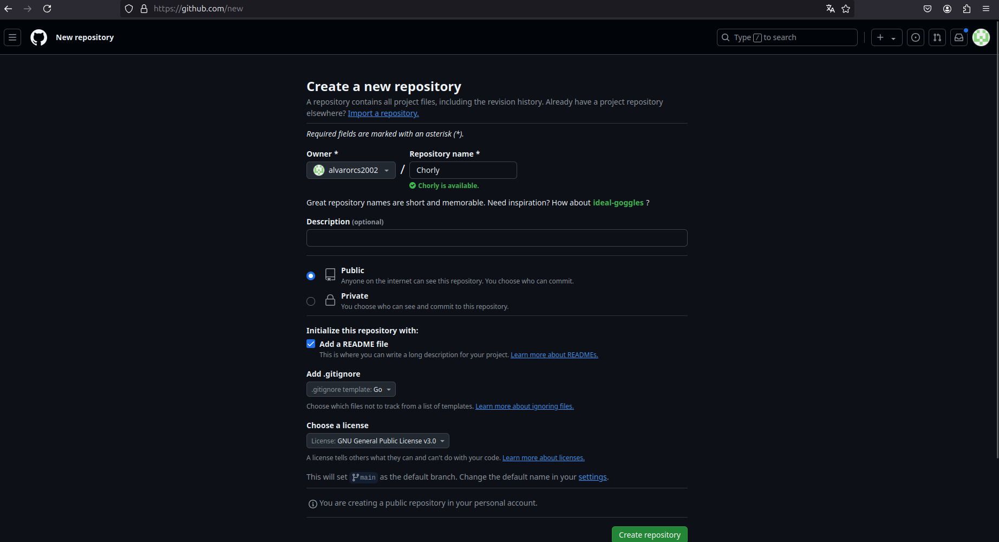

# Creacion del repositorio 

Selecciono la casilla para hacer que el repositorio sea publico , añado el Readme.md
Elijo la licencia de software libre GNU General Public License v3.0 
Creo un .gitignore por defecto  

# Configuracion ssh de GitHub
